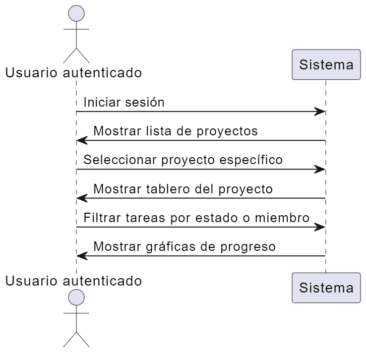
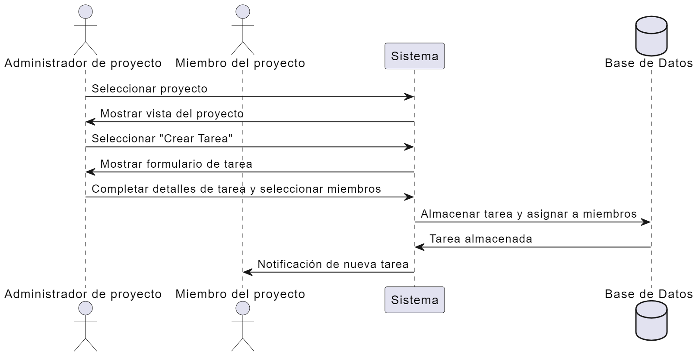
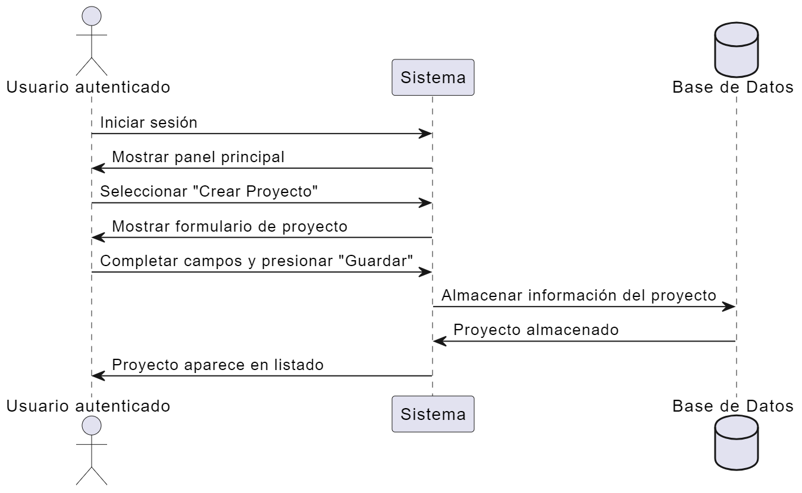
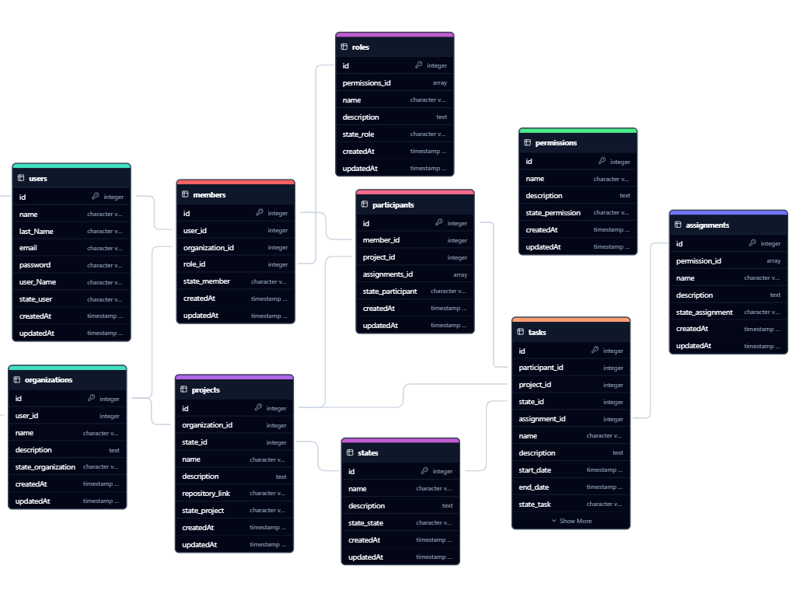

# Software Requirements Specification (SRS)

## Introducción

Project Track es una plataforma de gestión de proyectos diseñada para ofrecer una solución flexible y escalable, adaptada a las necesidades de los equipos de desarrollo y, en el futuro, a diversos tipos de proyectos empresariales. Aunque en su versión inicial puede parecer una aplicación básica en comparación con otras herramientas de gestión de proyectos, su verdadera fortaleza radica en su capacidad de crecimiento y personalización. La plataforma está pensada para ser una base sólida que permita a los usuarios ir añadiendo nuevas funcionalidades de acuerdo con sus necesidades, sin la necesidad de migrar a otras aplicaciones o herramientas.

Lo que distingue a Project Track de otras soluciones es su enfoque en la centralización y la integración. A medida que crece la plataforma, los usuarios no necesitarán cambiar de programas o aplicaciones para gestionar diferentes aspectos de su proyecto. Por ejemplo, así como en Visual Studio Code se pueden integrar extensiones para gestionar bases de datos o realizar solicitudes HTTP, Project Track busca ofrecer una experiencia similar. Los usuarios podrán gestionar tareas, manejar bases de datos, realizar consultas, enviar solicitudes HTTP, e incluso comunicarse con su equipo, todo desde una sola plataforma.

El sistema está diseñado para adaptarse a nuevas funcionalidades como un gestor de mensajes, notificaciones, calendarios y posibles herramientas de colaboración como videollamadas o compartición de pantalla, sin la necesidad de recurrir a aplicaciones externas. La meta es que todas las necesidades del equipo de trabajo en torno a un proyecto sean cubiertas en un solo lugar, evitando la fragmentación de herramientas y mejorando la productividad.

En resumen, Project Track no solo permite gestionar tareas y proyectos de manera eficiente, sino que también está diseñado para crecer con el usuario, integrando herramientas necesarias para cada proyecto y asegurando que todas las necesidades queden cubiertas en un solo espacio.

### Propósito :

El principal propósito de Project Track es ser una plataforma flexible y personalizable que facilita el seguimiento y la gestión integral de proyectos. Inicialmente orientado a desarrolladores de software, Project Track incluye características pensadas específicamente para este público, como la integración de enlaces a repositorios y herramientas de desarrollo, pero su flexibilidad permitirá que se adapte a otros tipos de proyectos y equipos.

La idea principal es que los usuarios puedan crear un proyecto y personalizarlo de acuerdo con sus necesidades, agregando secciones como la gestión de tareas, los enlaces a repositorios, la asignación de responsables, entre otras. Al esto permitir la personalización, Project Track se adapta a proyectos de cualquier tipo y tamaño, desde un pequeño equipo de desarrolladores hasta empresas más grandes que requieren una mayor complejidad en la gestión de sus procesos.

A medida que Project Track evolucione, será capaz de manejar todos los aspectos relacionados con un proyecto, desde la colaboración en tiempo real entre los miembros del equipo hasta la gestión de calendarios, reuniones y notificaciones, todo dentro de la misma plataforma. El objetivo final es proporcionar una herramienta unificada que elimine la necesidad de recurrir a múltiples aplicaciones para gestionar un solo proyecto.

### Alcance :

Project Track está dirigido inicialmente a desarrolladores de software que buscan una plataforma flexible y escalable para gestionar sus proyectos de manera más eficiente. Sin embargo, su potencial de crecimiento lo hace ideal para otros sectores y equipos de trabajo que requieren una herramienta robusta y personalizable para gestionar cualquier tipo de proyecto.

Esta plataforma permitirá a los equipos de desarrollo tener un control más centralizado sobre sus proyectos, evitando la necesidad de recurrir a múltiples herramientas para realizar tareas específicas. Con su capacidad de personalización, Project Track también podrá adaptarse fácilmente a las necesidades de otros tipos de usuarios y sectores, como gestión empresarial, marketing, diseño, etc., convirtiéndose en una solución integral para cualquier proyecto que requiera seguimiento y colaboración efectiva.

### Definiciones, Acrónimos y Abreviaciones :

- PostgreSQL: Base de datos relacionales utilizada para almacenar datos de proyectos, tareas, usuarios y roles.
- Sequelize: ORM (Object-Relational Mapping) utilizado para interactuar con PostgreSQL, permitiendo manejar las consultas y modelos de base de datos de manera más sencilla.
- 2FA (Autenticación de Dos Factores): Método de autenticación que añade una segunda capa de seguridad, requiriendo una verificación adicional al iniciar sesión.
- JWT (JSON Web Token): Token que se utiliza para la autenticación y autorización en la plataforma, asegurando que las interacciones entre el cliente y el servidor sean seguras.
- React: Biblioteca de JavaScript utilizada en el frontend para construir interfaces de usuario.
- Sass: Preprocesador de CSS que permite escribir estilos de manera más organizada y eficiente.

### Referencias :

Documentos adicionales o manuales que puedan ser útiles, como normativas, guías o documentos relacionados con el proyecto.

## Descripción General del Sistema

### 1. Descripción técnica del backend:

El backend está construido con Node.js y el framework Express.js, utilizando PostgreSQL como base de datos principal y Sequelize como ORM para manejar modelos y consultas. El sistema de autenticación se maneja con JWT y es compatible con 2FA para garantizar la seguridad.
Además, se cuenta con varios scripts principales para la gestión del proyecto:

1. Creación de componentes (controladores, rutas, modelos):

   - Los componentes pueden crearse individualmente o en combinaciones utilizando diferentes flags: -r (rutas), -m (modelos), -c (controladores).
   - Ejemplos de combinaciones:
     - npm run create -- <name> -rmc / Crea las rutas, el modelo y el controlador.
     - npm run create -- <name> -c / Solo crea el controlador.
   - También se incluye la bandera -respara reescribir archivos existentes.

2. Importación de rutas:

   - Se ejecuta con node importRoutes o npm run import.
   - Este script importa automáticamente todas las rutas en un archivo index.js dentro de la carpeta de rutas, y luego este archivo se importa en el index.js principal de la API

### 2. Descripción técnica del backend:

El frontend está desarrollado en React, utilizando una estructura modular de componentes con estilos organizados a través de Sass. La estructura de estilos incluye:

- Base: Estilos globales (reset.scss, typography.scss, global.scss).
- Temas: Definición de temas (dark.scss, light.scss).
- Utilidades: Utilidades y mixins (mixins.scss, functions.scss).

Los componentes de React se organizan en carpetas dentro de src/components, con archivos .jsy .scss asociados para cada componente.

Además, cuenta con un script para la creación automatizada de componentes:

- Crear componente: npm run create-c -- <nombre_del_componente> / Crea la carpeta, el archivo .jsy el archivo .scss del componente.

### 3. Dependencias del sistema

### 1. Node.js : Utilizado para el desarrollo del backend y manejo de las API.

- Versión recomendada : 16.xo superior.
- Dependencias principales :

  - Express (v4.19.2): Framework para manejar rutas y peticiones HTTP.
  - Sequelize (v6.37.3): ORM para manejar la interacción con la base de datos PostgreSQL.
  - pág (v8.12.0): Conector para PostgreSQL.
  - bcrypt (v5.0.1): Para el cifrado de contraseñas.
  - jsonwebtoken (v9.0.2): Para la generación y verificación de tokens JWT.
  - NodeCron (v3.0.2): Para la ejecución programada de tareas (tareas cron).

### 2. PostgreSQL : Base de datos utilizada para almacenar la información del sistema, incluyendo usuarios, proyectos, tareas, etc.

- Versión recomendada : 13.xo superior.

### 3. Interfaz :

- React (v18.2.0): Utilizado para la creación de la interfaz de usuario.
- Sass (v1.77.8): Preprocesador CSS para manejar los estilos.
- React-Router : Para manejar las rutas en el frontend.

- nodemon: v3.1.4

### 5. Requisitos del sistema

### 1. Servidor :

- RAM : Mínimo 4GB.
- CPU : 2 vCPU o superior.
- Almacenamiento : 20 GB de espacio libre para la base de datos y archivos del proyecto.

### 2. Entorno de desarrollo :

- Se recomienda usar Visual Studio Code con extensiones como ESLint para asegurar la calidad del código.
- Postman : Herramienta para probar APIs y realizar solicitudes HTTP.

### 3. Documentación :

- Se utilizará JSDoc para documentar las funciones y módulos del backend, generando documentación automáticamente a partir del código.

### Perspectiva del Sistema :

Describir dónde se ubica el sistema dentro de un entorno más grande (por ejemplo, interacción con otros sistemas).
[Falta]

### Funciones del Sistema :

Un resumen de las funciones principales.
[Falta]

### Usuarios del Sistema :

Quiénes usarán el sistema (administradores, usuarios regulares, etc.).
[Falta]

### Restricciones :

Cualquier limitación técnica, de negocio o de uso que pueda afectar el desarrollo.
[Falta]

### Suposiciones y Dependencias :

Aclarar las suposiciones que se están haciendo sobre cómo funcionará el sistema.
[Falta]

## Requisitos Funcionales

### Autenticación y Aut

- El sistema debe permitir que los usuarios se registren utilizando un correo electrónico y una contraseña.
- El sistema debe permitir que los usuarios inicien sesión utilizando sus credenciales y generen un token JWT válido.
- El sistema debe invalidar el token JWT después de 30 minutos de inactividad.
- El sistema debe permitir la recuperación de contraseñas mediante un enlace enviado al correo electrónico del usuario.
- El sistema debe permitir la autenticación de dos factores (2FA) como una opción adicional para los usuarios.
- El sistema debe bloquear el acceso después de 5 intentos fallidos de inicio de sesión.

### Gestión de proyectos

- El sistema debe permitir que los usuarios crean proyectos con un título, descripción, estado y fecha de inicio.
- El sistema debe permitir a los administradores agregar miembros al proyecto y asignarles roles específicos (ej. Administrador, Colaborador, Visualizador).
- El sistema debe permitir que los usuarios asigne tareas a miembros del proyecto, con un título, descripción, estado y prioridad.
- El sistema debe permitir cambiar el estado de un proyecto entre “En progreso”, “Finalizado”, o “Pendiente”.
- El sistema debe permitir que los usuarios actualicen la descripción o estado de un proyecto.
- El sistema debe permitir adjuntar documentos o enlaces externos (ej. Repositorios de GitHub) al proyecto.

### Notificaciones

- El sistema debe enviar notificaciones por correo electrónico cuando se asigna una tarea a un usuario.
- El sistema debe mostrar notificaciones en tiempo real (usando WebSockets o similares) dentro de la interfaz del usuario cuando ocurren eventos relevantes (nuevas tareas, cambios de estado).
- Las notificaciones deben poder ser configuradas por el usuario para habilitar/deshabilitar ciertas alertas.

### Historial de cambios

- El sistema debe mantener un historial de cambios en cada proyecto, que incluya información como cambios en el estado, actualizaciones de descripción o asignación de tareas.
- Los administradores deben poder visualizar el historial completo de cambios en cada proyecto.

### Funcionalidades Principales :

Aquí se describe en detalle lo que debe hacer el sistema. Por ejemplo:
Autenticación y autorización de usuarios (iniciar sesión, 2FA).
Manejo de proyectos (crear, modificar, eliminar).
Interacciones entre usuarios y el sistema (notificaciones, asignación de tareas, etc.).

### Casos de uso :

#### Crear proyecto

- Requisito funcional relacionado : El sistema debe permitir que los usuarios crean proyectos con un título, descripción, estado y fecha de inicio.

#### Autenticación y Autorización

- Requisito funcional relacionado : El sistema debe permitir que los usuarios inicien sesión utilizando sus credenciales y generen un token JWT válido.

### Requisitos de Interfaz de Usuario (UI) :

#### Pantalla de Inicio de Sesión :

- El sistema debe permitir que los usuarios ingresen su nombre de usuario y contraseña en un formulario sencillo.
- Los errores de inicio de sesión deben ser mostrados en la parte superior del formulario con mensajes claros.

#### Panel de Proyectos :

- Los proyectos deben mostrarse en una lista con información relevante como el título, estado y fecha de creación.
- Los usuarios deben poder filtrar proyectos por estado (Pendiente, En Progreso, Finalizado).

#### Asignación de tareas :

- En la vista del proyecto, los usuarios deben poder ver una lista de tareas asociadas y asignar nuevas tareas mediante un botón "Asignar Tarea".
- Al crear o editar una tarea, se deben mostrar opciones de prioridad (Alta, Media, Baja) y estado (Pendiente, En Progreso, Completada).

## Requisitos no funcionales

### Rendimiento

- El sistema debe responder a las solicitudes de creación de proyectos en menos de 2 segundos bajo condiciones normales de carga.
- El sistema debe cargar la lista de proyectos del usuario en menos de 1 segundo bajo condiciones normales de carga.
- Las notificaciones en tiempo real deben mostrarse con un retraso máximo de 500 ms tras ser enviadas.

### Escalabilidad

- El sistema debe soportar un crecimiento de usuarios sin afectar el rendimiento utilizando estrategias de escalabilidad horizontal (añadir más servidores).
- La base de datos debe ser capaz de manejar hasta 1000 usuarios activos simultáneamente sin degradar el rendimiento.

### Seguridad

- El sistema debe utilizar HTTPS para todas las comunicaciones entre el cliente y el servidor.
- Las contraseñas de los usuarios deben ser almacenadas utilizando un algoritmo de hash seguro como bcrypt .
- El sistema debe cifrar los datos sensibles en reposo, incluyendo contraseñas, tokens de autenticación y cualquier otra información confidencial.
- Los tokens JWT deben ser firmados con una clave secreta y tener una caducidad máxima de 30 minutos .
- El sistema debe implementar controles de acceso basados ​​en roles (RBAC) para restringir el acceso a funcionalidades específicas dependiendo del rol del usuario.

### Mantenimiento

- El sistema debe estar documentado utilizando herramientas como JSDoc para documentar las funciones y clases en el backend.
- El código debe estar estructurado en módulos bien definidos (controladores, modelos, rutas) para facilitar futuras modificaciones y mantenimiento.
- Se deben realizar pruebas automatizadas (unitarias e integración) utilizando Jest o herramientas similares para asegurar la funcionalidad.

## Requisitos de Interfaces Externas

### Interfaz de Usuario :

Describe los elementos de la UI y cómo deben comportarse.
[Falta]

### Interfaz de Hardware :

[Falta]
Si aplica, defina cualquier hardware que interactúe con el software.

### Interfaz de software :

Especificar cómo interactúa el sistema con otros sistemas o API.
[Falta]

### Interfaz de comunicación :

Protocolos de comunicación utilizados (HTTP, WebSockets, etc.).
[Falta]

## Diagramas y modelos UML

Aquí es donde se incluyen los diagramas para representar visualmente la estructura y el comportamiento del sistema. Los más comunes son:
[Falta]

### Diagrama de casos de uso :

### 1. Creación de un Proyecto

### 2. Asignación de Tareas

### 3. Visualización del Progreso del Proyecto  

### Diagrama de clases :

### Diagrama de secuencia :

Muestra cómo interactúan los diferentes componentes del sistema en secuencia.
[Falta]

### Diagrama de actividades :

Representa el flujo de trabajo del sistema o sus módulos.
[Falta]

### Diagrama de implementación :

Opcional, pero útil para describir la arquitectura de hardware y software.
[Falta]

## Gestión de pruebas

### Plan de Pruebas :

Cómo se van a probar las funcionalidades y qué herramientas se utilizarán.
[Falta]

### Tipos de pruebas :

Pruebas unitarias, de integración y pruebas de aceptación de usuarios (UAT).
[Falta]

## Trazabilidad de requisitos

<table>
    <thead>
        <tr>
            <th>Requisito funcional</th>
            <th>Caso de Uso Asociado</th>
            <th>Prueba Asociada</th>
        </tr>
    </thead>
    <tbody>
        <tr>
            <td align="left">El sistema debe permitir que los usuarios se registren e inicien sesión.</td>
            <td align="left">CU-01 : Registrar e Iniciar Sesión</td>
            <td align="left">Prueba unitaria del endpoint de registro/login.</td>
        </tr>
        <tr>
            <td align="left">El sistema debe generar un token JWT válido para las sesiones de usuario.</td>
            <td align="left">CU-01 : Registrar e Iniciar Sesión</td>
            <td align="left">Verificación de JWT en las respuestas de inicio de sesión.</td>
        </tr>
        <tr>
            <td align="left">El sistema debe permitir la recuperación de contraseñas mediante correo electrónico.</td>
            <td align="left">CU-02 : Recuperar Contraseña</td>
            <td align="left">Prueba unitaria de envío de correo de recuperación.</td>
        </tr>
        <tr>
            <td align="left">El sistema debe permitir que los usuarios crean proyectos.</td>
            <td align="left">CU-03 : Crear Proyecto</td>
            <td align="left">Prueba funcional del formulario de creación de proyectos.</td>
        </tr>
        <tr>
            <td align="left">El sistema debe permitir la asignación de tareas a los miembros del equipo.</td>
            <td align="left">CU-04 : Asignar tareas</td>
            <td align="left">Prueba de asignación de tareas a un miembro del proyecto.</td>
        </tr>
        <tr>
            <td align="left">El sistema debe mantener un historial de cambios en cada proyecto.</td>
            <td align="left">CU-05 : Visualizar Historial de Cambios</td>
            <td align="left">Prueba de visualización de cambios en los proyectos.</td>
        </tr>
        <tr>
            <td align="left">El sistema debe enviar notificaciones por correo electrónico cuando se asigna una tarea</td>
            <td align="left">CU-06 : Enviar Notificaciones de Tareas</td>
            <td align="left">Prueba del sistema de notificaciones por correo.</td>
        </tr>
    </tbody>
</table>

### Mapeo de Requisitos :

Cada requisito funcional debe estar enlazado a una parte del sistema para asegurar que se cumpla.

[Falta]
